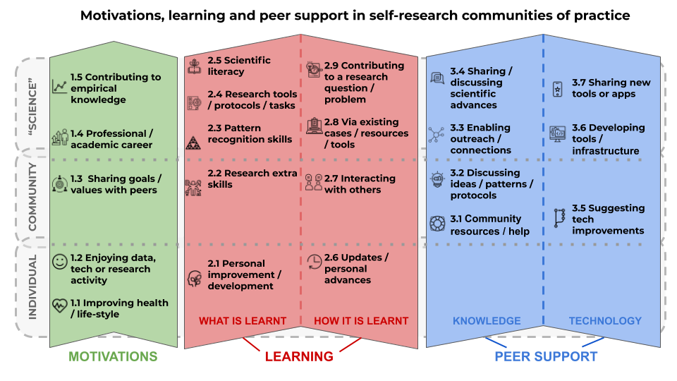
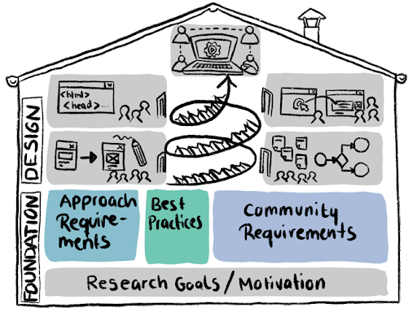
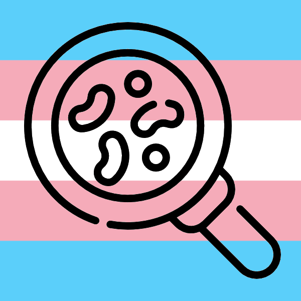

# Projects

## Self-Research: Motivations, Peer Support & Learning

This study at the intersection between citizen science and personal science addresses what are the current barriers and opportunities for enabling self-research processes through open communities of practice. More concretely, via mainly qualitative methodologies we are advancing in a better understanding of peer support dynamics within the community of self-researchers, as well as participants' learnings and motivations. Our main goal is to identify and help replicate valuable knowledge that can contribute to scaling-up this emerging area of participatory science. 

Link: [https://peerproducedresearch.github.io/Keating-Memorial-research/](https://peerproducedresearch.github.io/Keating-Memorial-research/)

## User-centered design for Citizen Science

Within the framework of a PhD, this project explores the potential of a peer-production approach in citizen science in a specific use case: The self-research platform Open Humans. The project aims to cover all steps of a user-centered development process, together with a foundation of peer-production theory and practice. In a first step, a dimension model of commons-based peer-production will be developed, which will serve as a reference for the further design. For each dimension, best practices and features of existing peer-production online projects will be collected, in order to discuss their potential benefit for the Open Humans platform. Alongside, the high-level goals, the current workflow, as well as the specific requirements of the Open Humans project and its users will be analysed. Secondly, based on the results of this first step, the platform will be redesigned in a user-centered, iterative approach. This means that potential platform designs will be co-created, evaluated and improved in an iterative manner in close cooperation with the target user group, from sketches to actual implementations. 

Link: [https://github.com/katoss/phd-project/](https://github.com/katoss/phd-project/), [https://projects.cri-paris.org/projects/DngFftiU/summary](https://projects.cri-paris.org/projects/DngFftiU/summary) 

## Transbiome

The Transbiome study is a community-driven project aiming at characterizing the microbiota of trans women’s neo-vaginas. Vaginal infections are a common occurrence: Bacterial vaginosis has a prevalence of 29.2% and three out of four cis-women will experience at least one vaginal yeast infection in their life. But while these conditions are well understood for cis-women, they are poorly understood for trans women, to a point that diagnosis, testing and treatment are often unavailable or unsuccessful. This is a direct result of a lack of basic knowledge about the microbial community that colonizes the neo-vagina after its creation. To address this issue, we aim to perform a pilot study that helps to map the microbial diversity found in trans-women’s neovaginas, providing urgently needed basic knowledge about it which can inform future research which can help trans women to get adequate gynecological health care.

## Quantified Flu

Quantified Flu is a community-driven, co-created project that started out of the Open Humans community calls at the start of the COVID-19 pandemic. The goal of the project is to allow individuals to use their physiological data collected from wearables (like heart rate, body temperature and respiratory) and give them a way to visualize it in the context of their symptom reports, allowing them to interpret and reason about it. As such it is a case study of a new, domain-appropriate cultural and technological kit to support personal science that serves a community. 

Link: [https://www.quantifiedflu.org](https://www.quantifiedflu.org)

## COVID Twitter 
The COVID19 Twitter Annotation project is a collaboration between the Peer-Produced Research Lab and the Interaction Data Lab. It aims to model how tweets about self-reported COVID19 symptoms can help predict upcoming pandemic waves, and more generally the rise and fall of the disease. Unlike typical annotation-driven citizen science project, this project uses a co-creation, open science approach: All the data, analyses and source code are available from the start and in real time, enabling citizens to take part in research projects at all levels, from crowdsourcing to machine learning algorithms. 

Link: [https://covid-twitter.thecommons.science/](https://covid-twitter.thecommons.science/)

## Covid Open Survey

The Covid Open Survey is an international collaboration between the CRI, the University of Sydney, the Australian National University, the University of Notre Dame, Open Source Pharma and Open Humans. It’s a daily survey about the impact of the pandemic on mental wellbeing, physical health and other factors. Participants are invited to contribute not only by filling out the survey, but also by contributing their own research questions and survey items, thus taking charge of the research directions as well. 

Link: [https://opencovid.care](https://opencovid.care)
