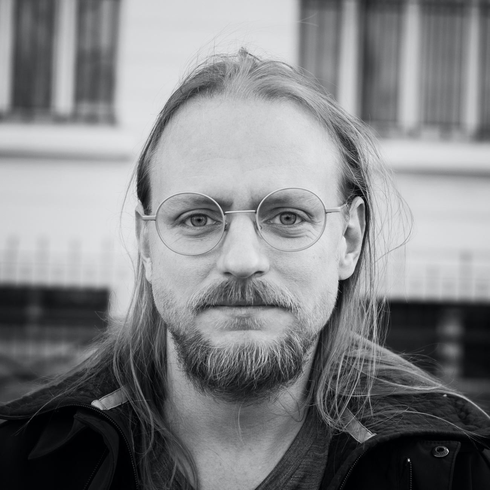
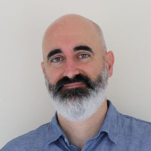
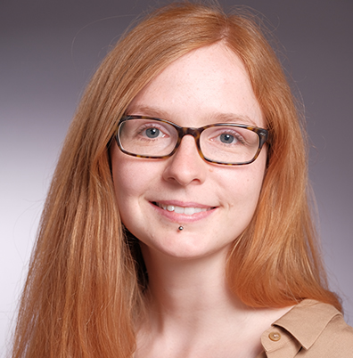
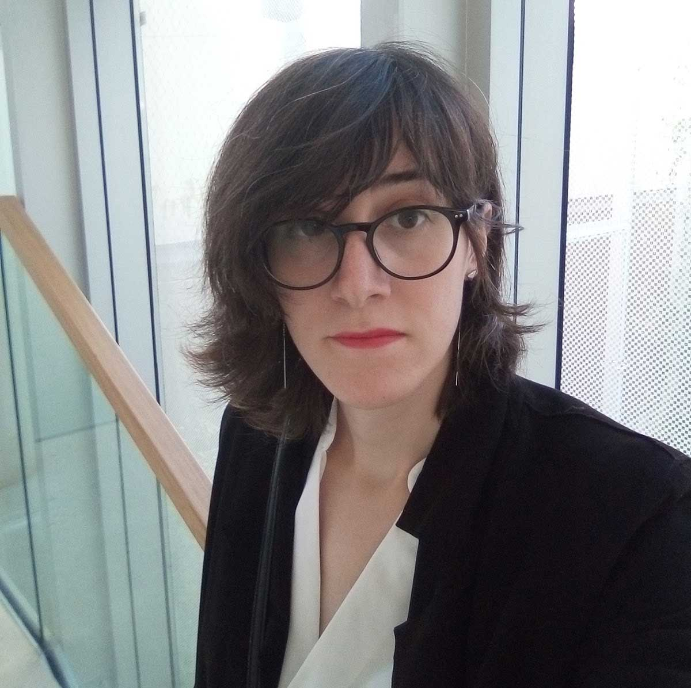

# Team

## Bastian
<!---->

Bastian is the team leader of the Peer-Produced Research Lab. He started his career as a biologist and bioinformatician before his interests in open science led him to do research on co-creation in community/citizen science. In 2011, he co-founded openSNP – an open, crowdsourced repository for personal genomics data which has become one of the largest of its kind. Since 2017 he is also the Director of Research for the Open Humans Foundation, which runs a web platform to empower individuals and communities to access and understand their personal data and help them do and share things with it. Bastian is particularly interested in how peer-production ideals can be implemented to support scaling up Quantified Self/Personal Science projects to take them from the n=1 to collective endeavours. 

[Twitter](https://twitter.com/gedankenstuecke/)
[GitHub](https://github.com/gedankenstuecke)
[LinkedIn](https://scholar.google.com/citations?user=xmtDOnQAAAAJ&hl=en)
 
## Enric
<!---->

Enric is a postdoctoral researcher at the Peer-Produced Research Lab. As a member of the Dimmons.net research group, he obtained his PhD in Sociology on the Information and Knowledge Society at the Internet Interdisciplinary Institute, from Universitat Oberta de Catalunya (UOC), under the direction of Dr. Mayo Fuster Morell. He has also developed his research at the Centre for Digital Humanities of the Austrian Academy of Science. Enric is a member of the Platoniq collective and co-founder of the Goteo.org platform for civic crowdfunding. He is currently interested in how to apply co-creation and qualitative methods to personal science and citizen science from a transdisciplinary perspective.

[Twitter](https://twitter.com/esenabre)
[Personal blog](http://www.backlogs.net/)
[Google Scholar](https://scholar.google.com/citations?user=8x9QLzUAAAAJ&hl=en)

## Mad

## Katharina
<!---->

Katharina is a PhD student at the Peer-Produced Research Lab in the Frontières de l’Innovation en Recherche et Éducation (FIRE) doctoral program. She holds a M.Sc. in Applied Cognitive and Media Science from the University of Duisburg-Essen and has worked as a research assistant in interdisciplinary health-monitoring research and language technology, and as a working student in UX consulting for the public sector. She is currently trying to apply her interdisciplinary background in human-computer-interaction, computer science and psychology and a passion for illustration and design to facilitate a peer-production approach in citizen science by the use of participatory, user-centered design methods, on the example of Open Humans. 

[Twitter](https://twitter.com/k_kloppenborg)
[GitHub](https://github.com/katoss)
[LinkedIn](https://www.linkedin.com/in/katharina-kloppenborg-6987a3193) 

## Morgane

## Clara
<!---->

Clara is a bioinformatics M2 student. She started working in the videogames industry around 2008 ; lead game designer, creative director, writer and programmer, she directed several projects before switching to medical science in 2018. Transactivist, she joined the Peer-Produced Research Lab in 2020 as part of the Transbiome project she initiated. Even though she doesn’t work in the videogames industry anymore, she is still very enthusiastic about systems and never stops to find bridges between biology and videogames. 

## Alumni:
- Basile	
- Illona
- Melvin
- Clemence
